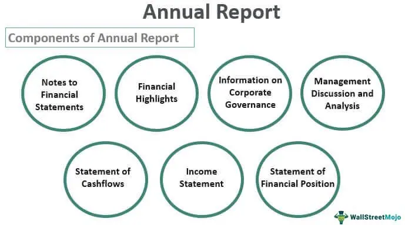
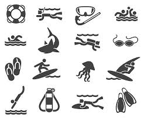
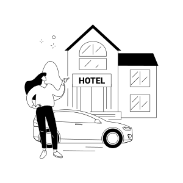

```{r setup, echo=FALSE}
options(htmltools.dir.version = FALSE)
knitr::opts_chunk$set(
  fig.width=8, fig.height=3.5, fig.retina=3,
  out.width = "100%",
  cache = FALSE,
  echo = TRUE,
  message = FALSE, 
  warning = FALSE,
  hiline = TRUE
)
```

```{r xaringan-themer, include=FALSE, warning=FALSE}
library(xaringanthemer)
style_mono_accent(
  base_color = "#0B0B61",
  header_font_google = google_font("Josefin Sans"),
  text_font_google   = google_font("Montserrat", "300", "300i"),
  code_font_google   = google_font("Fira Mono")
)
```

```{r, include=FALSE}
library(countdown) 
```

```{r, include=FALSE}
be <- "Bianna Edwards"
```

```{r, include=FALSE}
bb <-"Bertrand Bhikarry"
```
```{r, include=FALSE}
sm <-"Sean McCoon"
```
```{r, include=FALSE}
et <-"Environment Tobago"
```


```{r, include=FALSE}
thta <-"Tobago Hotel and Tourism Association"
```

<!-- THTA logo online -->

```{r xaringan-logo, echo=FALSE}
xaringanExtra::use_logo(
  image_url = "https://chi01pap002files.storage.live.com/y4mCFdriLW_arc7oXHUC6eKiGZiMHrTet2TLOTk4ognVuR0DYAABM60wi8j2qGMnBF_xDFJ0xKpGZe2bOxSmbEpW6irwKzm7dX6ynVHv1Ml6PUAWUD4UO9c9MCJJlGlDVgXTLW6uspM65L3TYgIXk_8s2v9wYkXOPdk8MNunVA1cUOoRFtyTvMIjs87htzrxYBJ?width=92&height=92&cropmode=none"
)
```
```{r broadcast, echo=FALSE}
xaringanExtra::use_broadcast()
```

```{r, echo=FALSE}
xaringanExtra::use_webcam(width = 300, height = 225)
```
```{r xaringan-panelset, echo=FALSE}
xaringanExtra::use_panelset()
```

```{r xaringanExtra, echo=FALSE}
xaringanExtra::use_xaringan_extra(c("tile_view", "animate_css", "tachyons"))
```

## Your digital brief

Make THTA AGM 2023 a good virtual experience   

  - These pages work like slides. Use Left and Right **arrow keys ** to navigate.

  - Intend to voting? Find and Keep your four digit THTA ID handy. (**recheck your Inbox** for Lana's email)

  - Explore. Get a quick view of what's ahead. Press **"O"**

  - Once more. **Right Arrow** key takes you thru the slides. 

---

## Links to Pollsheets 

1. [Large Hotels](#) 
1. [Small Hotels](#)
1. [Apartments and Guesthouses](#)
1. [Allied Services](#)
1. [Restaurants](#)
1. [Tour Guides](#)

---

## About the Facilitator

.left-column[

##### Bianna &nbsp; Edwards   

  
]

.right-column[
Managing Director/Facilitator    
I&eacute; Consulting    
2006 to Present (*17 years strong*)  
]

---
## AGM 2023 Procedure

  1. WELCOME
  
  1. **REVIEW & CONFIRM** MINUTES OF THE 2020 AGM   
    - [See Draft](#)
  1. **PRESIDENT’S REPORT**
    - [PDF](#)
    - [Audio](#)
    - [Video](#)
  1. **AUDITED ACCOUNTS**
    - [Link](#) to PDF
  1. **APPOINT** AUDITORS
    - [Poll](#) <!---shortlist --->
  1. **OTHER BUSINESS**      
  1. **ELECT** NEW DIRECTORS
    - [Nomination Form](#)


---

## Minutes of last AGM

.left-column[

[Click to read](#)

]

.right-column[

- Confirmation of minutes 
    * <input type= "checkbox" unchecked> Confirmed </input>   
    * <input type= "checkbox" unchecked> Seconded </input>
- Motion to Accept Minutes
    * <input type= "checkbox" unchecked> Moved</input>
    * <input type= "checkbox" unchecked> Ratified</input>
]

---

## President's Report 

.left-column[

  **Is this a video or livestream**?   

  
]

.right-column[
 
1. Report in 3 formats. 
  * [Clink to download as PDF](#)
  * [Audio](#)
  * [YOU TUBE Video](#)

]


---

## Financial Report 2019 - 2020
.panelset.sideway[
Some verbose comment goes here
.panel[.panel-name[Presentation]

]

.panel[.panel-name[Auditing]

Something about new auditors. 

Q: Should the old board be deciding on the Auditor? Probably a good thing to bring this item into a discussion
]

]


---
## Overview of todays electoral process

```{r, echo=FALSE}
DiagrammeR::grViz("
digraph {
graph [rankdir= TB]

# nodes 

node [shape = box, fontname="Josefin Sans"]

A [label='Nominations for Pres', shape = invhouse]; 
B [label= 'Whiteboard', shape = box]; 
C [label='Results whiteboarded', shape = box]; 
D [label= 'Repeat for VP', shape = invhouse]; 
# E [label= 'Repeat above process', shape= invtriangle];
G [label='Poll (Google Form)', shape= tab]; 
H [label='Congratulations', shape= signature]; 


# edges

A->B->C->D [arrowsize=0.3, color=gray];
B->G-> C [shape =plaintext, label = 'Some large explanation here'];
C->H [shape =invisible, label = ''];


}
")

```

---
## About THTA Board structure

Facilitator describe the Executive and Ordinary Board hierarchy

???
Ms Edwards explains the hierarchy of the THTA committees

---
 
## About the directorships (an overview)

.left-column[

### Ten directorships 

*to answer to them all*

]


.right-column[

**Hotel sector** (*4 Dir*)

<!-- shall from among their members elect four (4) Directors to represent them.   -->

**Guesthouse/B&B sector** (*1 Dir*)
 
 <!-- operators shall from among their members elect one (1) Director to represent them   -->
 
**Villa sector** (*1 Dir*)

<!-- Property Managers shall from among their members elect one (1) Director to represent them -->

**Restaurant sector** (*1 Dir*)

 <!-- owners or managers shall from among their members elect one (1) Director to represent them -->
 

 
 ** Marine sector** (*1 Dir*)
 
 <!-- shall from among their members elect one (1) Director to represent them -->


**Incoming Tour and Destination Mgmt sector** (*1 Dir*)

<!-- managers shall from among their members elect one (1)Director to represent them -->

**Allied Services sector**  (*1 Dir*)

 <!-- shall from among their members elect one (1) Director to represent them.   -->
]
---

## Nominations 

 xyz and more
---

## Nominations Marine Sector  

<!-- change 'nomination' to 'selection' -->

.left-column[

### Marine sector




]

.right-column[

**One Directorship up for grabs**
]
---
## Diagram of Process

Using DiagrammeR.



---
## Safe travels

<center></center>